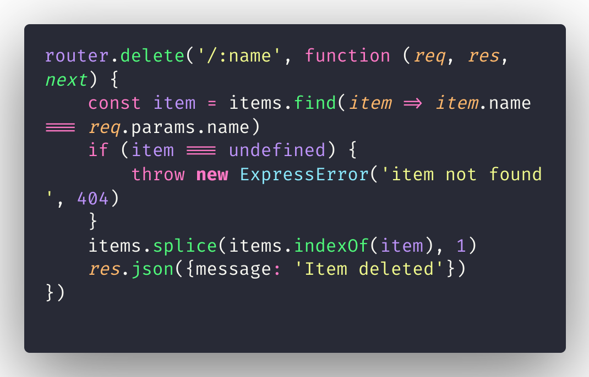
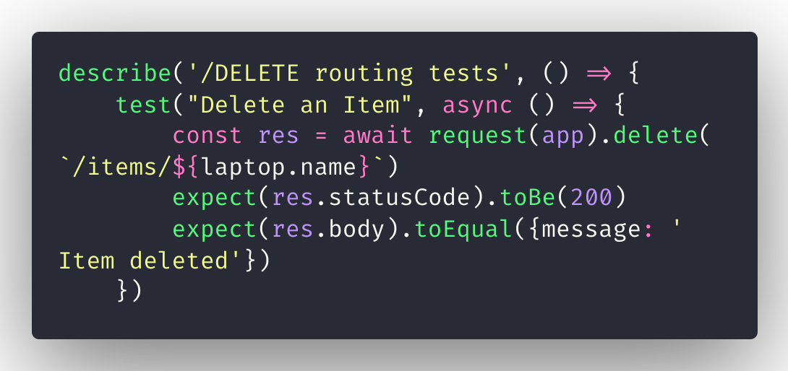
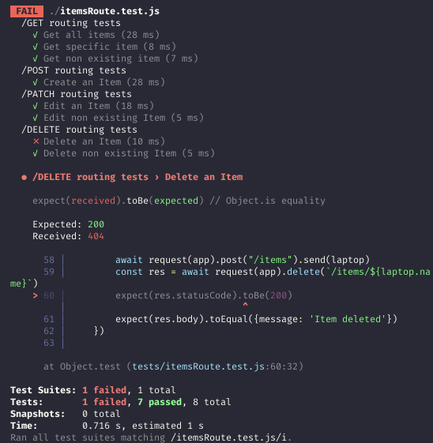

## Can't get /DELETE route to test correctly.

First the routing code:

Now the testing code:

Even though it works flawlessly in Insomnia, deleting the item by the name parameter. supertest client won't get a 200 code , it is always getting 404.

finally my testing results:
